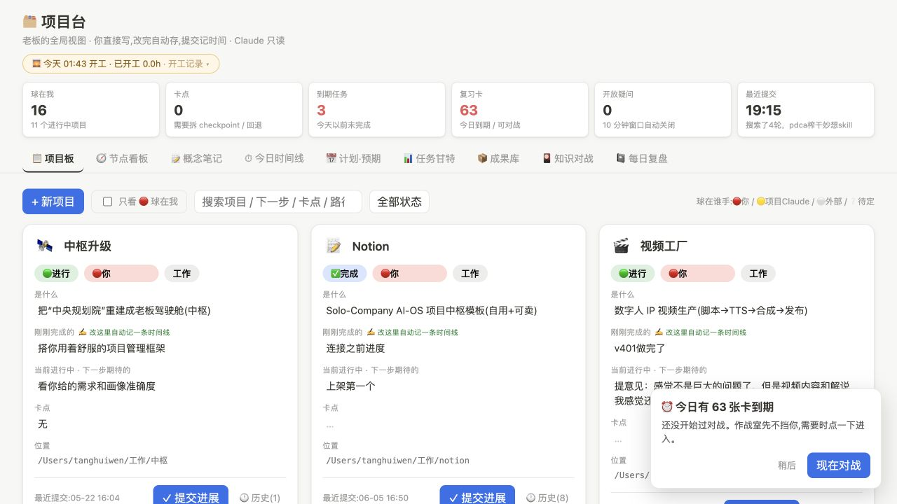

# War Room Dashboard

> Local-first command center for AI operators, solo builders, and people running many projects at once.

[](scripts/smoke_test.py)
[](LICENSE)
[](https://www.python.org/)
[](https://www.sqlite.org/)
[](#privacy-boundary)

War Room Dashboard is a zero-dependency personal operations dashboard. It turns scattered project notes into a structured cockpit with projects, timelines, tasks, artifacts, review cards, questions, and daily retrospectives.

It is designed for people who use AI agents seriously: every project needs a next action, a blocker, an owner, a timeline, and reusable assets that compound.

中文一句话：这是一个本地优先的个人作战室，用 SQLite 做真相源，把项目、任务、成果、知识对战和复盘收进一个可运行的中枢看板。



## Why This Exists

Most personal project systems slowly become a pile of Markdown files, chat transcripts, and unfinished dashboards. This project takes a stricter view:

- Projects should have current state, next action, blocker, and owner.
- Progress should become timeline evidence.
- Important output should become reusable artifacts.
- Learning should become review cards and questions.
- The database should remain local and private by default.

## Features

- Project board: status, owner, next step, blocker, path, and recent movement.
- Big goals: create goal containers, assign existing or new projects, and drag projects between goals or back to unassigned.
- Command strip: "mine", blockers, due tasks, review cards, open questions, recent commits.
- Timeline: project-lane view of real daily progress.
- Gantt tasks: dates, owners, goals, progress, and overdue cues.
- Artifact library: SOPs, ideas, docs, links, datasets, and notes.
- Knowledge battle: SM-2 style review cards with multi-role feedback.
- Question loop: ask follow-up questions on cards and close stale threads automatically.
- Daily review: lightweight review entries with checks and notes.
- Local-first storage: SQLite database created on first start.
- Zero runtime dependencies: Python standard library only.

## Quick Start

```bash
git clone https://github.com/pagoda111king/war-room-dashboard.git
cd war-room-dashboard
./start.sh
```

Open:

```text
http://127.0.0.1:8766
```

Use another port:

```bash
PORT=8876 ./start.sh
```

Health check:

```bash
curl http://127.0.0.1:8766/api/health
```

The health response also reports the number of big goals and projects after the first-start database migration.

## Requirements

- Python 3.10+
- A modern browser
- No Node.js, package manager, or external database required

## Privacy Boundary

The real source of truth is `app/项目台.db`, a local SQLite database created on first start.

The repository intentionally ignores:

- `*.db`
- `*.sqlite`
- `.env`
- logs
- caches
- local build output

Do not commit a real personal database to a public fork. Use the generated demo seed for public demos.

## Configuration

Environment variables:

| Variable | Default | Description |
| --- | --- | --- |
| `PORT` | `8766` | HTTP server port |
| `OPENMAIC_URL` | `http://127.0.0.1:8770` | Optional local LLM hook for card questions |

## Project Structure

```text
war-room-dashboard/
  app/
    index.html        # Single-page dashboard UI
    server.py         # Zero-dependency Python HTTP + SQLite server
  docs/
    API.md
    ARCHITECTURE.md
    CI.md
    OPEN_SOURCE_RELEASE.md
    PACKAGING_NOTE.md
  examples/
    seed-projects.json
  scripts/
    smoke_test.py
  .github/
    ISSUE_TEMPLATE/
  start.sh
```

## Documentation

- [Architecture](docs/ARCHITECTURE.md)
- [API Reference](docs/API.md)
- [CI Recipe](docs/CI.md)
- [Open Source Release Checklist](docs/OPEN_SOURCE_RELEASE.md)
- [Packaging Note](docs/PACKAGING_NOTE.md)
- [Roadmap](ROADMAP.md)
- [Contributing](CONTRIBUTING.md)
- [Security](SECURITY.md)

## Development

Compile check:

```bash
python3 -m py_compile app/server.py scripts/smoke_test.py
```

Database seed smoke test:

```bash
python3 scripts/smoke_test.py --db-init-only
```

Running server smoke test:

```bash
./start.sh
python3 scripts/smoke_test.py --url http://127.0.0.1:8766
```

## Roadmap Snapshot

- Import/export project packs.
- Safer schema migrations.
- Optional authentication for private LAN usage.
- Optional LLM provider adapters for question answering.
- More node/DAG views for agent workflows.

See [ROADMAP.md](ROADMAP.md) for the full plan.

## License

MIT License. See [LICENSE](LICENSE).
